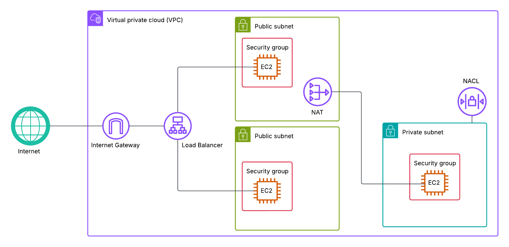

# Multi-Tier AWS Web App

An AWS web application hosted within a custom VPC, with a private backend and public frontend behind an Application Load Balancer, leveraging Security Groups, NACL and NAT Gateway to build a secured cloud architecture.

