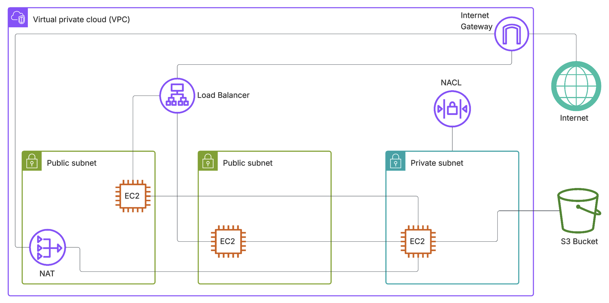

# Multi-Tier AWS Web App

A multi-tier AWS web application within a custom VPC, with a private backend and public frontend behind an Application Load Balancer, integrating S3 for data storage and leveraging Security Groups, NACL and NAT Gateway for secure networking.

